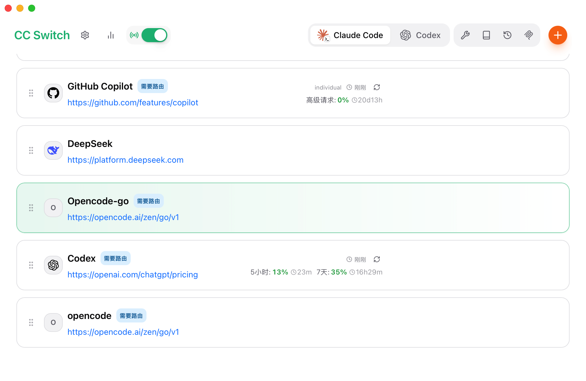

## 前言

最近半年一直在使用 AI Agent 辅助开发，使用的是一套比较稳定的 Claude Code + ccswitch + 国内模型的工作流，开发环境是macos，偶尔会用wsl2。本文记录一下我的使用经验和踩坑过程。

## 工具介绍

### Claude Code

[Claude Code](https://docs.anthropic.com/en/docs/claude-code) 是 Anthropic 推出的命令行 AI 编程助手，可以直接在终端中与 Claude 交互
可以在官网或者是多个地方搜索并安装，本人安装的是cli版本而不是软件版本，因为更方便开发
### ccswitch

[ccswitch](https://github.com/yichuancc/ccswitch) 是一个 Claude Code 的模型切换工具，可以让你在 Claude Code 中使用不同的模型后端（比如 DeepSeek、GLM等国内模型），同时还能管理如codex,gemini,opencode,龙虾等其他agent。

具体界面如下：

可以通过右上角的+来添加供应商。

### 国内模型

目前我主要使用的国内模型：
- **DeepSeek** ：Deepseek V4 flash/pro
- **GLM 系列**：GLM5.1

## 环境搭建

### 1. 安装 Claude Code

```bash
# 使用 npm 全局安装
npm install -g @anthropic-ai/claude-code
# 也可以通过homebrew安装，不同操作系统的命令都可以去搜索
# 启动
claude
```

### 2. 安装和配置 ccswitch

```bash
# 安装 ccswitch
npm install -g ccswitch

```
## 使用技巧

### 1. 善用 CLAUDE.md

在项目根目录创建 `CLAUDE.md` 文件，写入项目的背景信息和开发规范。Claude Code 每次启动都会读取它，相当于给 Agent 设置了持久记忆：

```markdown
# 项目说明
这是一个基于 React + TypeScript 的前端项目...

# 开发规范
- 使用 pnpm 作为包管理器
- 组件使用函数式组件 + Hooks
- 样式使用 TailwindCSS
```

### 2. 任务拆分

不要一次给太大的任务。把大需求拆成小步骤，每步确认无误再继续：

```
❌ 帮我实现一个完整的用户认证系统
✅ 先帮我创建 User 模型和数据库迁移
✅ 然后实现注册接口
✅ 再实现登录接口和 JWT 生成
```

### 3. 及时纠正

如果 Agent 走偏了方向，立刻打断并纠正，不要等它做完再推倒重来：

```
> 停，不要用 class 组件，我们项目统一用函数式组件，请重新来
```

### 4. 利用 /compact 节省上下文

对话太长时，使用 `/compact` 命令压缩上下文，避免 token 浪费：

```
/compact
```

### 5. 复杂任务使用 Plan 模式

Claude Code 内置了 plan 模式（shift+tab切换），让它先制定计划再执行：

```
> /plan 帮我重构这个模块的错误处理逻辑
```

## 使用经验

### 省钱（token）策略

1. **简单任务一律用国内模型**：生成模板代码、写注释、格式化等
2. **善用缓存**：Claude Code 有 prompt cache，5 分钟内复用上下文不重复收费
3. **控制上下文长度**：定期 `/compact`，避免把无关文件带入上下文，compact后面也可以加注释告诉它要保存什么
4. **Plan 模式省钱**：先让模型制定计划（消耗少），确认后再执行（避免错误执行浪费 token）

## 常见问题


