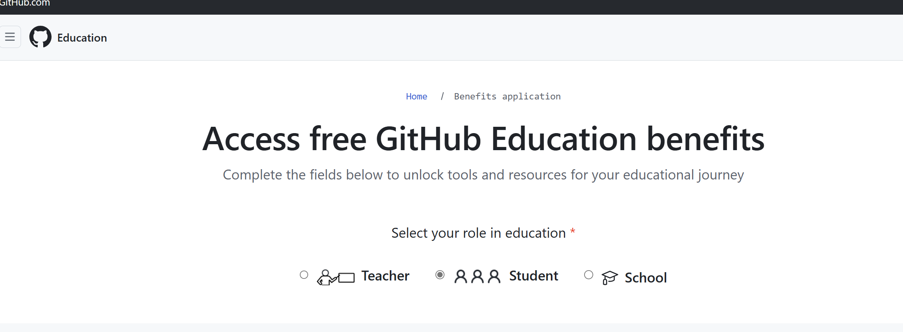
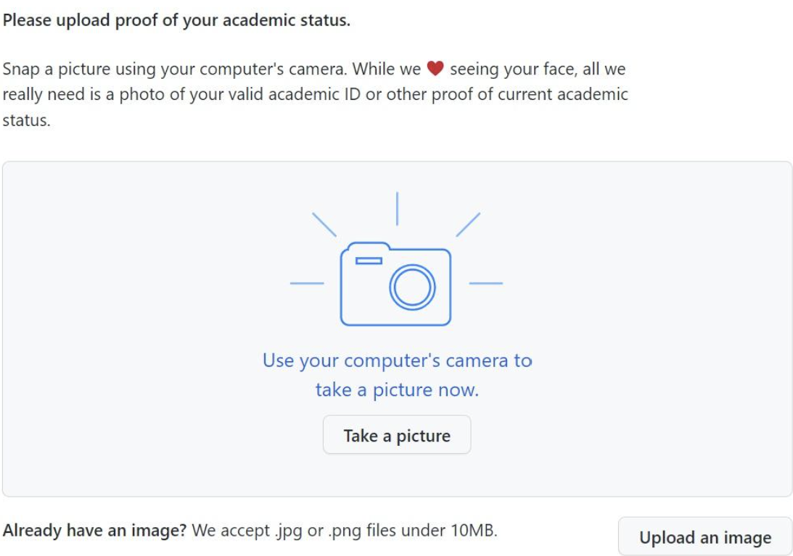
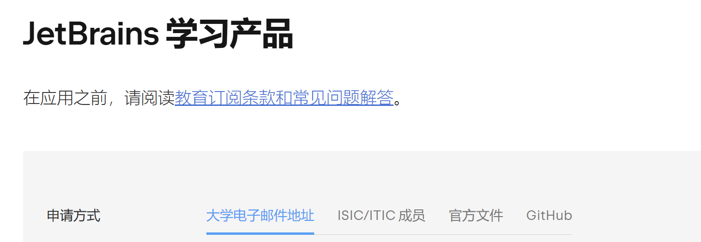

## github学生包

github学生包全称是叫github student developer pack，是github推出的学生优惠，可以免费使用github的很多服务，包括github pages，github actions，github copilot等等。我个人感觉比较好用的有github pages和github copilot，还有就是域名的免费申请。

### 申请地址

[这是github学生包的申请地址](https://education.github.com/)

[这是学生包的具体领取地址](https://education.github.com/pack)

### 准备材料

教育邮箱（即学校发放的<http://edu.cn>后缀的邮箱）（非必须）

以下材料四选一:

- 带有学校名称，学校公章（如有），个人信息及有效期的学生证
- 带有学校名称，入学日期和学校公章的录取通知书（推荐）
- 学信网的个人学籍报告或学校出具的在读证明（最好是学校信纸头的），最好是英文版的（推荐）
- 学期课表、成绩单等Github支持的其他认证材料（不推荐，通过率低）

### 申请流程

1. 申请前提需要一个github账号
2. 打开GitHub benefits
3. 选择“Student

4. 输入相关信息:姓名、学校、邮箱（建议输入教育邮箱）、地址等等，还有申请原因（这个随便说说）
5. 材料认证：这里是最难的一步，本人因为多种原因被卡住过，一共申请提交11次才通过。总的来说，它是让你上交一张能证明你现在是学生的材料，而且现在都要求使用摄像头拍照，电脑好像搞不了还得手机去拍。


### 踩坑记录

本人尝试过贴学生证，一卡通，录取通知书，教育部在线学籍报告都未通过。后来提交的是学校系统可以下载的在读证明（有英文材料），然后上传，审核通过。看过其他其他一些帖子，上传英文版的教育部在线学籍报告（30rmb）也可以通过，但是本人没有试过，不知道是否可行；另外，学生证那些材料，你在上面批注好英文应该也可以通过。（关键:学生信息以及最好有英文版本的容易过）。此外，还有一些别的报错，我都贴出来如下：

```plaintext{style="white-space: pre-wrap;"}
1. The image you selected does not appear to contain your school name. Your complete school name must appear in your document, not only the school logo. You may include multiple documents together. If your official document is not in English then you may photograph the original next to an English translation.
2. Please secure your GitHub account with two-factor authentication. You may need to log out and log back in to GitHub before reapplying.
3.The image you captured appears to be a screen display. Please take a clear, live photo of physical documentation confirming your academic enrollment.
4.Please complete your GitHub billing information with your full name exactly as it appears in your academic affiliation document. You do not have to add a payment method. You may need to log out and log back in to GitHub before reapplying. If you have only a single legal name, enter it in both the first and last name fields.
5.You must configure your browser and operating system to allow location access. You may not use a VPN. If you believe that our information about your school is incomplete or incorrect, then please select ‘My selected school has incorrect or incomplete information e.g. domains or campus location’ option when submitting a GitHub Education support ticket.
```

这几个问题主要包括vpn，github信息完善，github两阶段验证等信息方面的问题，还有图片方面的问题，以及这里说一下3,3其实是我最后通过的版本，只不过是我用手机拍了电脑上的证明文件，它说是截图不行，这里只要你把它拍的完整一下，不要漏出电脑其他界面就行了，当然你有打印的版本最好不过了。

### 注意事项

1. 照片认证成功后，github会告诉你，你的权益很快就会到达（本人等了三天左右）;等申请成功后，github会给你发邮件，邮件里会告诉你学生包的截止日期，以及你领取的链接，所以一定要及时查收邮件。
2. github学生包的截止日期是1年，所以如果想要续签的话，一定要及时续签，不然你的学生包就会失效。
3. github学生包的续签方式有两种，一种是手动续签，另一种是自动续签。手动续签的话，需要在截止日期前手动续签，自动续签的话，你需要在截止日期前自动续签。

## jetbrains学生包

jetbrains学生包的话，用途主要就是可以用jetbrians的一些好用的IDLE，比如pycharm的专业版，clion（C/C++，开发）webstorm，（js开发）等等。喜欢用jetbrains全家桶的必不可少（本人更喜欢vs code一些，感觉jetbrian是更庞大）

### 申请地址

[这是申请地址](https://www.jetbrains.com/zh-cn/community/education/#students)  
[jetbrians官网](https://www.jetbrains.com/zh-cn/)


### 申请流程

1. 首先要有一个jetbrians账户，然后打开jetbrains学生包官网，点击申请。
2. 填写信息  
这里有四种认证方法如下:

  

这里面最容易的应该是直接用前面提到的github的学生认证去认证jetbrians，基本都是秒过。如果发生报错的话（基本都是提示邮箱被锁定什么的），可以去github个人setting那儿把自己的教育邮箱先暂时删掉，再申请基本秒过。  
此外应该是官方文件那个比较容易，里面相比起第一个来说，主要是增加了一个教育部在线认证报告，不过我试过这个没通过（不知道是不是github上面有教育邮箱的原因），看别的帖子说也有教育邮箱滥用的情况，最后还是用github申请的。至于第二个那个国际学生认证我感觉用的应该比较少吧
3. 等待审核  
有的基本是秒通过，有的可能要等几天，注意看邮箱就行。

## 参考链接

有几个参考链接，可以参考一下：
https://zhuanlan.zhihu.com/p/578964972
https://blog.csdn.net/m0_63451989/article/details/131743070
